# KasperskyCyberimmuneHack2023
Foxhoundteam solution, KasperskyCyberimmuneHack2023

- [KasperskyCyberimmuneHack2023](#kasperskycyberimmunehack2023)
- [Описание компонентов репозитория](#описание-компонентов-репозитория)
- [Отчёт о выполнении задачи "Создание программы для управления оборудованием на теплоэлектростанции"](#отчёт-о-выполнении-задачи-создание-программы-для-управления-оборудованием-на-теплоэлектростанции)
  - [Постановка задачи](#постановка-задачи)
  - [Известные ограничения и вводные условия](#известные-ограничения-и-вводные-условия)
    - [Цели и Предположения Безопасности (ЦПБ)](#цели-и-предположения-безопасности-цпб)
  - [Архитектура системы](#архитектура-системы)
    - [Компоненты](#компоненты)
      - [Прикладное ПО. Развёрнутый комментарий](#прикладное-по-развёрнутый-комментарий)
    - [Алгоритм работы решения](#алгоритм-работы-решения)
      - [Получение и обработка данных от полевых устройств не требующие дополнительной обработки](#получение-и-обработка-данных-от-полевых-устройств-не-требующие-дополнительной-обработки)
      - [Получение и обработка данных от полевых устройств требующие дополнительной обработки](#получение-и-обработка-данных-от-полевых-устройств-требующие-дополнительной-обработки)
      - [Изменение установок ПП с АРМ](#изменение-установок-пп-с-арм)
      - [Обновление ПП ПЛК](#обновление-пп-плк)
      - [Выполнение команды диспетчера на остановку оборудования](#выполнение-команды-диспетчера-на-остановку-оборудования)
    - [Описание Сценариев (последовательности выполнения операций), при которых ЦБ нарушаются](#описание-сценариев-последовательности-выполнения-операций-при-которых-цб-нарушаются)
      - [Сценарий 1a. Компрометация мажоритарной логики.](#сценарий-1a-компрометация-мажоритарной-логики)
      - [Сценарий 1b. Компрометация мажоритарной логики.](#сценарий-1b-компрометация-мажоритарной-логики)
      - [Сценарий 2. Компрометация интерфейса датчиков.](#сценарий-2-компрометация-интерфейса-датчиков)
      - [Сценарий 3. Компрометация оркестратора.](#сценарий-3-компрометация-оркестратора)
      - [Сценарий 4. Компрометация валидатора.](#сценарий-4-компрометация-валидатора)
    - [Указание "доверенных компонент" на архитектурной диаграмме.](#указание-доверенных-компонент-на-архитектурной-диаграмме)
    - [Политики безопасности](#политики-безопасности)
  - [Запуск приложения](#запуск-приложения)
    - [Развертывание через docker-compose](#развертывание-через-docker-compose)
- [Описание переменных окружения](#описание-переменных-окружения)
  - [KAFKA\_SERVER](#kafka_server)
  - [OPENSEARCH\_HOST](#opensearch_host)
  - [KAFKA\_TOPIC](#kafka_topic)
  - [SOURCE\_KEY\_MAP](#source_key_map)
  - [BROKER\_USER](#broker_user)
  - [BROKER\_PASS](#broker_pass)
  - [BROKER\_SERVER](#broker_server)
  - [POLICIES](#policies)
  - [PRIVATE\_KEY](#private_key)
- [Пример генерации ключей](#пример-генерации-ключей)
- [Примечание](#примечание)

# Описание компонентов репозитория

- `license_server` - сервер лицензирования
- `monitor` - [монитор безопасности](#политики-безопасности)
- `plc` - компоненты ПЛК
- `sample_processes` - примеры реализации процессов для взаимодействия с монитором
- `scada` - компоненты SCADA
- `sensors` - компоненты имитации сенсоров
- `storage` - версии ПП

# Отчёт о выполнении задачи "Создание программы для управления оборудованием на теплоэлектростанции"
## Постановка задачи
Необходимо создать прикладную программу (ПП), в которой будут реализованы следующие функции для корректной работы теплоэлектростанции:
- Получение и обработка данных от полевых устройств:
  - Сигналы, не требующие дополнительной обработки
  - Сигналы, для которых необходима дополнительная логика
обработки, чтобы получить итоговое значение
- Изменение установок ПП с АРМ
- Обновление ПП ПЛК
- Выполнение команды диспетчера на остановку оборудования


## Известные ограничения и вводные условия
По условиям организаторов должна использоваться:
- Микросервисная архитектура
- Шина обмена сообщениями (Apache Kafka) для реализации асинхронной работы сервисов
- Security Monitor - сервис авторизации запросов все запросы между сервисами проходят через SM, прямой обмен сообщениями между сервисами запрещён по условиям задачи.


### Цели и Предположения Безопасности (ЦПБ)
Цели безопасности:
1. АСУ ТП всегда получает целостные критичные данные от ПЛК
2. ПЛК выполняет только аутентичное ПП
3. Конечное оборудование всегда получает аутентичные команды
4. Только авторизованные пользователи имеют доступ к лицензии ПЛК

Предположения безопасности:
1. Физическая защита периметра обеспечена
2. Персонал ТЭЦ благонадежен
3. Технологическое оборудование (Турбина) исправное
4. Уровень устройств ввода-вывода - доверенный
5. Рассматривается экспериментальная ТЭЦ, где оператор имеет только удалённый доступ к системе управления


## Архитектура системы

### Компоненты

| Название | Назначение | Комментарий |
|----|----|----|
| *Валидатор* |<ul><li>контроль целостности файлов ПП и обновлений ПП,</li><li>контроль целостности файлов настроек и обновлений настроек,</li><li>выдачу на шину подтверждения, что файлы проверены и их можно использовать в работе.</ul>| **Доверенный компонент**. В рамках условности прототипа валидатор и оркестратор объединены в единый модуль|
| *Оркестратор ПП* | <ul><li>контроль целостности виртуальной памяти запущенных процессов ПП,</li><li>контроль собственной целостности в виртуальной памяти и на диске,</li><li>запуск новых версий прикладного ПО после подтверждения от компонента "Валидатор",</li><li>организацию пула нескольких одновременно работающих версий ПП, каждая из которых представлена тремя различающимися экземплярами для работы по мажоритарной логике (triple voting),</li><li>"бесшовный" запуск новых версий и останов старых, при котором гарантируется, что в каждый момент времени одновременно работает как минимум 2 версии и по 3 экземпляра ПП,</ul>| **Доверенный компонент**. В рамках условности прототипа валидатор и оркестратор объединены в единый модуль |
| *Мажоритарная логика* | <ul><li>сравнение параметров телеметрии, выдаваемых экземплярами ПП, по мажоритарному принципу, принятие решения о целостности данных и выдача на SCADA или ЧПИ оператора,</li><li>сравнение команд управления устройствами (включая защиту), сформированных экземплярами ПП, принятие решения о целостности данных по мажоритарному принципу и передача на устройство, с подтверждением в SCADA и ЧМИ оператора</li></ul>| **Доверенный компонент** |
| *Интерфейс датчиков* |<ul><li>выдача показаний датчиков в SCADA по REST,</li><li>выдача показаний датчиков в ПП по шине (с соответствующим контролем монитора).</li></ul>| **Доверенный компонент** |
| *Монитор безопасности* | //TODO описать | **Доверенный компонент** |
| *Прикладное ПО* | <ul><li>регулярный приём показаний датчиков из компонента "Интерфейс датчиков" и автоматическое управление подключенным оборудованием (срабатывание защиты)</li><li>выдачу по запросу SCADA показаний датчиков, предварительно обротанных по заданному алгоритму (для получения непосредственных показаний без обработки следует общаться со SCADA напрямую к доверенному компоненту "интерфейс датчиков") </ul> | **Недоверенный компонент** по причинам использования сторонних компонентов и библиотек, большого объёма кода, который сложно контролировать, и возможного вовлечения сторонних подрядчиков.|

#### Прикладное ПО. Развёрнутый комментарий
Каждый экземпляр прикладного ПО представлен набором из как минимум трёх одновременно работающих модулей. Каждый модуль реализует один и тот же функционал и одни и те же алгоритмы управления и обработки показаний датчиков. Выходные сигналы от каждого экземпляра обрабатываются доверенным компонентом "Мажоритарная логика". 


Для снижения вероятности одновременного отказа или компрометации, экземпляры ПП должны быть
* разработаны различными подрядчиками или командами разработчиков,
* разработаны на различающемся технологическом стеке (разные языки, версии языков, библиотеки),
* собраны на различных машинах.

### Алгоритм работы решения

#### Получение и обработка данных от полевых устройств не требующие дополнительной обработки
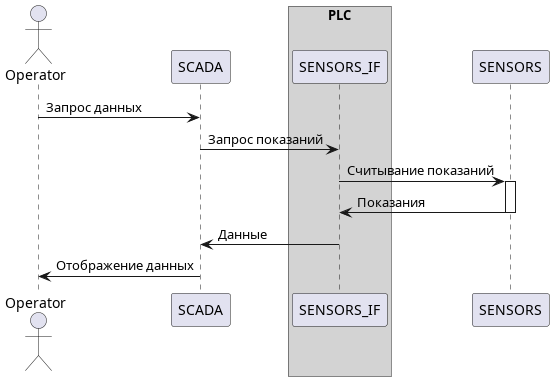

#### Получение и обработка данных от полевых устройств требующие дополнительной обработки
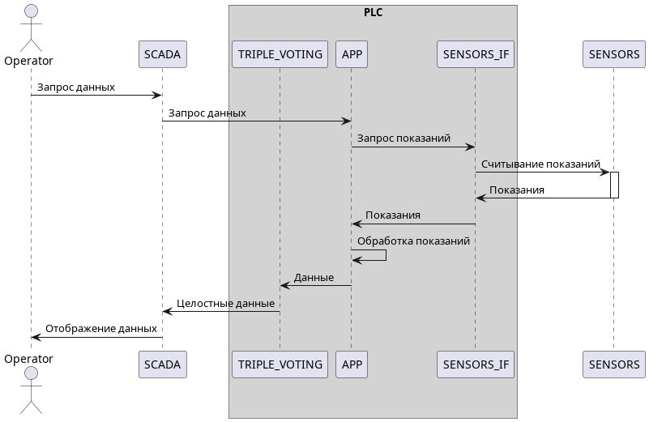

#### Изменение установок ПП с АРМ
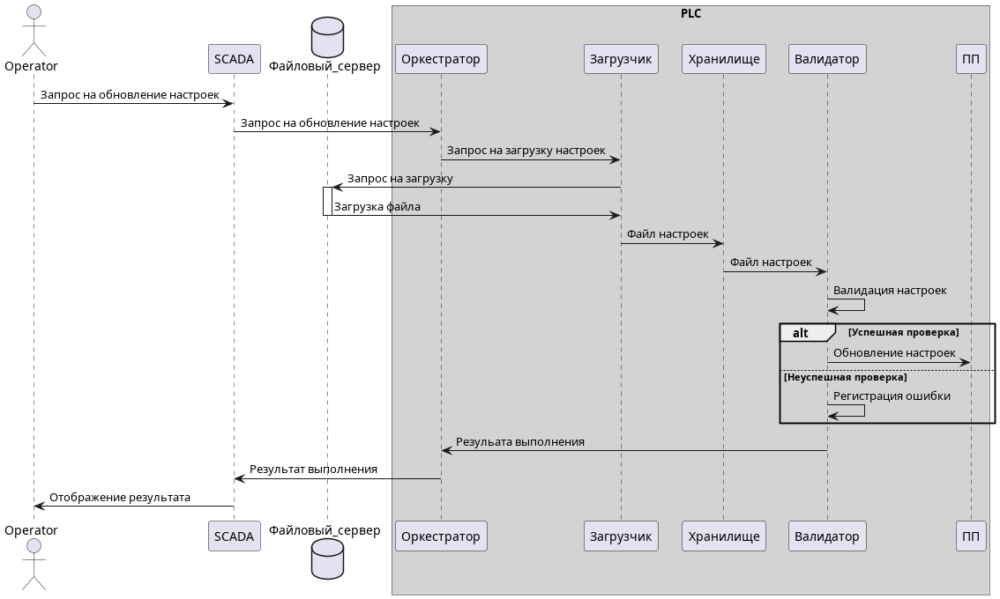

#### Обновление ПП ПЛК
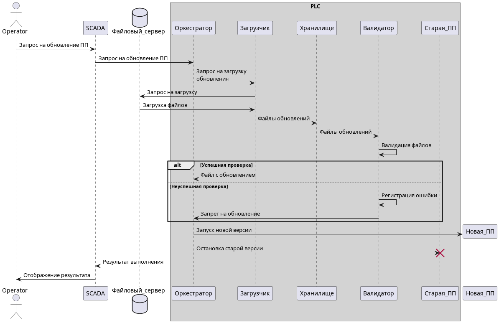

#### Выполнение команды диспетчера на остановку оборудования
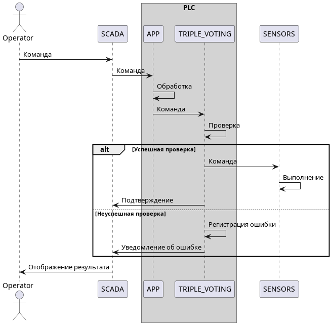

### Описание Сценариев (последовательности выполнения операций), при которых ЦБ нарушаются

#### Сценарий 1a. Компрометация мажоритарной логики.
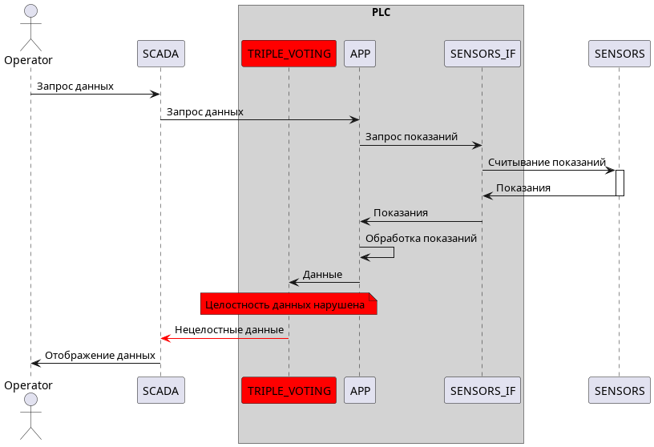

Мажоритарная логика выбирает неверные показания от ПП. Нарушается цель безопасности №3

#### Сценарий 1b. Компрометация мажоритарной логики.
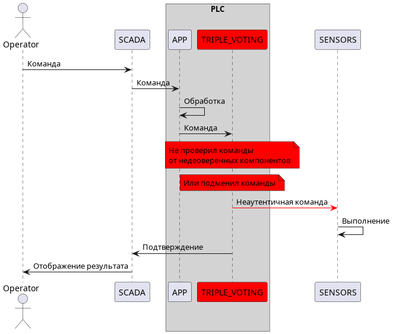

Мажоритарная логика выбирает неверные команды от ПП. Нарушается цель безопасности №1

#### Сценарий 2. Компрометация интерфейса датчиков.
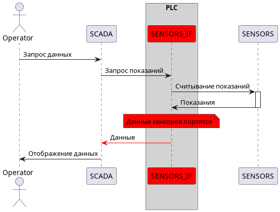

Интерфейс датчиков отдаёт неверные значения (или вообще не отдает). Нарушается цель безопасности №1

#### Сценарий 3. Компрометация оркестратора.
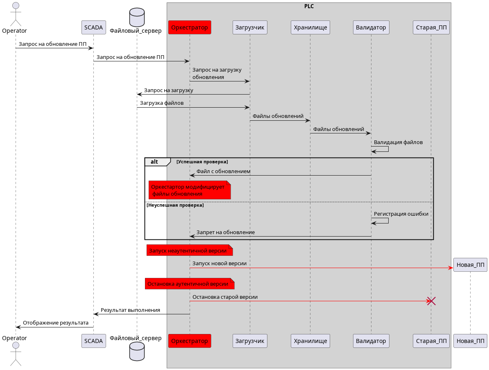

Оркестратор распространяет неаутентичную ПП. Нарушается цель безопасности №2

#### Сценарий 4. Компрометация валидатора.
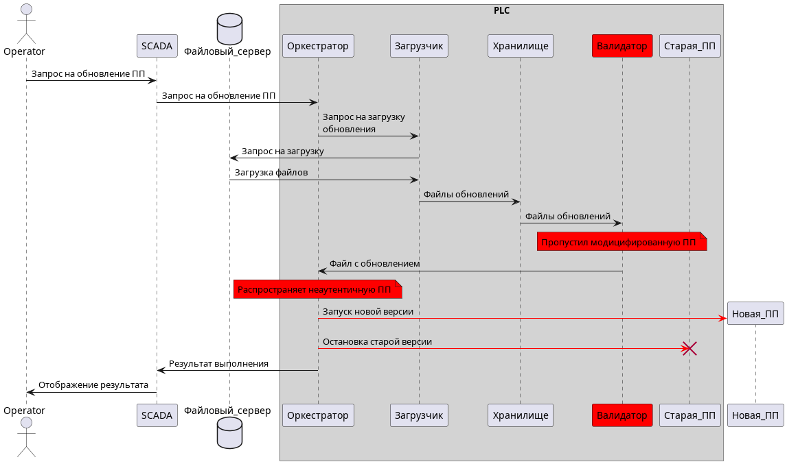

Валидатор пропускает модифицированную ПП, как следствие оркестратор распространяет неаутентичную ПП. Нарушается цель безопасности №2

### Указание "доверенных компонент" на архитектурной диаграмме.

Обобщённая диаграмма архитектуры

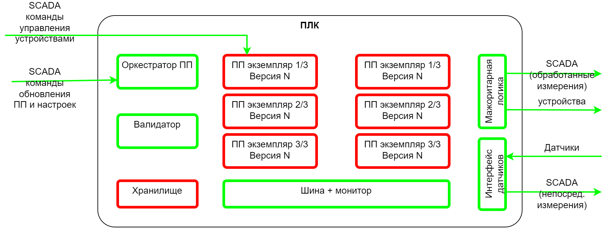

На данном рисунке указаны, ввиду общей сложности, только  связи с внешними элементами системы (SCADA, ЧМИ оператора, датчики, исполнительные устройства), а цветами обозначены доверенные и недоверенные компоненты. Более детальную схему, с внутренними связями выделением компонентов, повышающих целостность данных, имеет смысл описывать для различных потоков данных:

| | |
|----|----|
| Выдача команд исполнительным устройствам с ПП (автоматика) и команд оператора | Получение простой информации непосредственно с датчиков в ПП и SCADA |
| 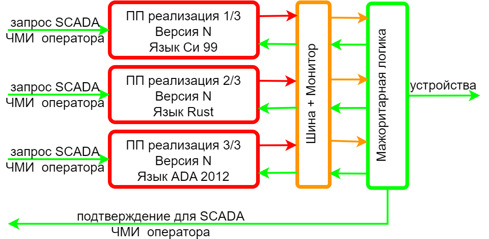 | 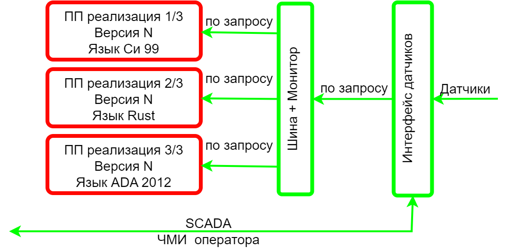 |
| Получение информации с датчиков, требующей обработки на устройстве | Обновление ПП и лицензий |
| 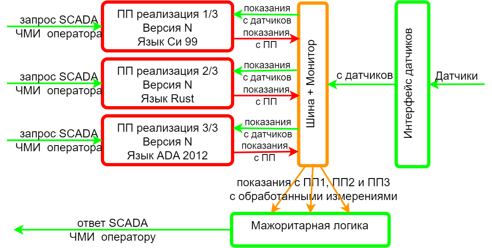 | 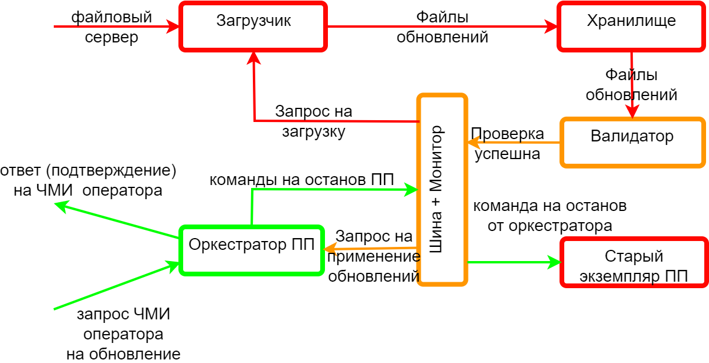 |
| Обновление настроек |  |
| 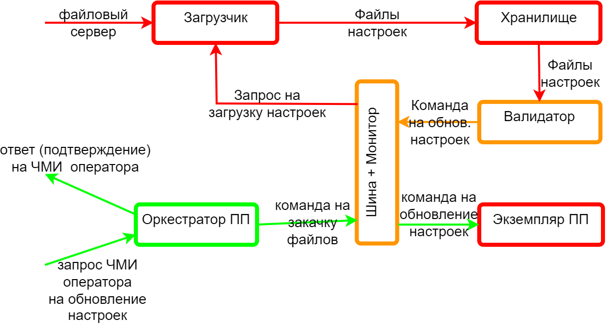 |  |


### Политики безопасности 

Схема работы монитора безопасности


Описание работы монитора:

Монитору известны публичные ключи всех процессов.

Когда процесс хочет обратиться к другому процессу, он записывает сообщение в формате JSON в топик monitor. При этом он обязательно подписывает его своим приватным ключом.

Монитор слушает топик monitor, при получении нового сообщения, он отправляет задачу в rabbitmq с этим сообщением. Это необходимо для возможности масштабирования.

Воркеры dramatiq выполняют следующие валидации:
1. Получили валидный JSON
2. Источник существует
3. Тело запроса передано от источника (проверка подписи)
4. Получатель существует
5. Разрешена пересылка сообщений от источника к получателю
6. Тип сообщения существует
7. Проверка корректности тела сообщения

Если хотя бы одна из этих валидаций не проходит, то воркер пишет warning лог в elk и отклоняет такое сообщение. 

Если же все этапы успешно пройдены, то сообщение кладется в топик, который слушает процесс назначения

Код монитора расположен в `monitor`

## Запуск приложения

### Развертывание через docker-compose
1. Установить [docker](https://docs.docker.com/engine/install/ubuntu/)
2. В папке compose создать файл .env и [заполнить](#описание-переменных-окружения) его в соответствии с примерами
3. Запустить команду docker compose up -d с правами суперпользователя
```bash
sudo docker compose up -d
```

# Описание переменных окружения

## KAFKA_SERVER
Файлы: .env, .env.machine1, .env.machine2

Тип: строка

Назначение: адрес сервера кафки
## OPENSEARCH_HOST
Файлы: .env

Тип: строка

Назначение: хост елк стека

## KAFKA_TOPIC
Файлы: .env, .env.machine1, .env.machine2

Тип: строка

Назначение: топик монитора или подпроцесса

## SOURCE_KEY_MAP
Файлы: .env

Тип: словарь, пример `{"machine1": "-----BEGIN PUBLIC KEY-----\nMFwwDQYJKoZI..."}`

Назначение: словарь публичных ключей процессов

## BROKER_USER
Файлы: .env

Тип: строка

Назначение: юзернейм брокера

## BROKER_PASS
Файлы: .env

Тип: строка

Назначение: пароль брокера

## BROKER_SERVER
Файлы: .env

Тип: строка

Назначение: сервер брокера

## POLICIES
Файлы: .env

Тип: список списков, пример `[["rest", "machine1"], ["machine1","rest"]]`

Назначение: описывает какие процессы могут взаимодействовать

## PRIVATE_KEY

Файлы: .env.machine1, .env.machine2

Тип: строка

Назначение: секретный ключ процесса

# Пример генерации ключей

```bash
openssl genrsa -out private.pem 512

openssl rsa -in private.pem -outform PEM -pubout -out public.pem
```

# Примечание
Просим обратить внимание, что наша команда нашла и сообщила экспертам об ошибке в ТЗ, нарушающей физическую безопасность предприятия. На закрытом чекпоинте в среду, 19 апреля, мы сообщили экспертам, что по Сценарию 3 из тех.задания устройства, подключенные к ПЛК, нельзя остановить без ключа лицензии. Эксперты согласились, это это нарушало бы физическую безопасность предприятия.